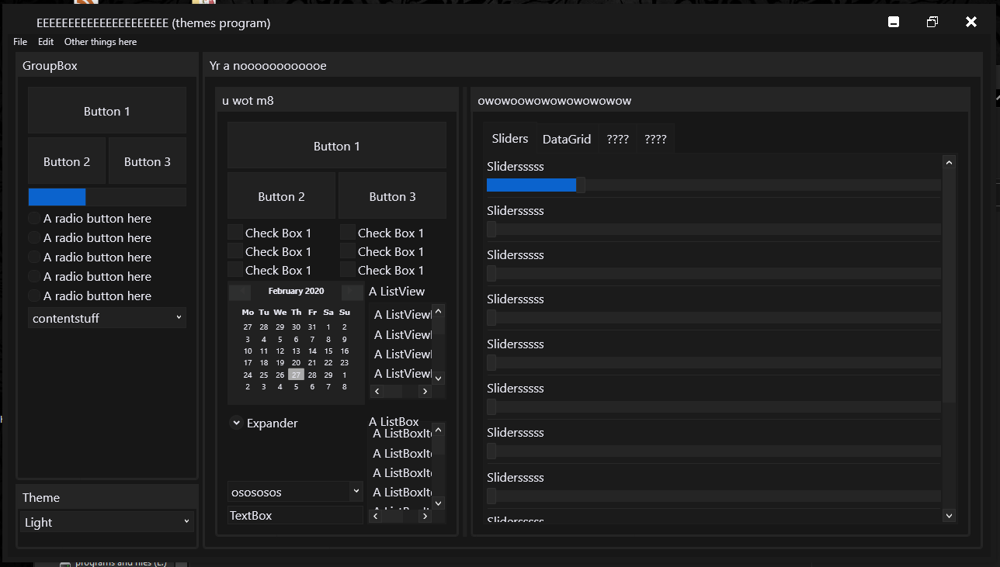

# The dark theme app
Latest Update:

i started making this maybe a few weeks ago. just drag and drop the Dark.xaml (located in the ThemesFolder folder) into your project (anywhere) and inside App.xaml place this:
```xml
<Application.Resources>
    <ResourceDictionary>
        <ResourceDictionary.MergedDictionaries>
            <ResourceDictionary Source="/ThemesFolder/Dark.xaml"/>
        </ResourceDictionary.MergedDictionaries>
    </ResourceDictionary>
</Application.Resources>
```
Also, i added some stuff used for MVVM for some reason. I only really used it for the light/dark combobox at the bottom left of the screen.
and thats about it. Enjoy :)
# Latest (big) Update
- Themed the titlebar! and it actually works now! however, some setup adding cs code is needed to get it to work. you need to set the mainwindow's datacontext to something, and inside that something needs to be 3 ICommands:CloseWindowCommand, MaximizeRestoreCommand, MinimizeWindowCommand. the code that these run can be seen in the MainViewModel and MainWindow.xaml.cs


- Improved the ComboBox; themed the ComboBoxItems
- added more colours to be used for styling, and a "special primary colour", which is dark blue atm.
- Improved the slider; rounded corners on the 'slider-puller-handle-thing', improved the different sizes of the progress bits on the slider, and the slider uses the "special primary colour".
- Also improved the ScrollBars (the scroll handle bit was darker than the backgroundy bit, so i changed that.
- Added some colours to the light theme too (not sure why you'd want to use it but eh)
- And finally improved the RadioBoxes by giving them a more circular shape, like they normally have.
# How to use CustomWindowStyle (with a changable titlebar colour)
Firstly, in a window's XAML, do:
```xml
Style="{DynamicResource CustomWindowStyle}"
```
You can use StaticResource if you're only using one theme (DarkTheme.xaml for example). DynamicResource simply means if CustomWindowStyle changes, it will change the window style, unlike Static where it'll never change.
## Setting up the Minimise/Restore/Close buttons, and their icons
You need to bind the window you're applying the style to, to a class (e.g. WindowViewModel). Inside that class needs to be 3 commands:
```cs
public ICommand MinimizeWindowCommand { get; set; }
public ICommand MaximizeRestoreCommand { get; set; }
public ICommand CloseWindowCommand { get; set; } 
```
These commands need to execute the following code:
```cs
public void CloseWindow() => Application.Current.MainWindow.Close();
public void MaximizeRestore()
{
    Window mainWindow = Application.Current.MainWindow;
    if (mainWindow.WindowState == WindowState.Maximized)
        mainWindowWindowState = WindowState.Normal;
    else if (mainWindow.WindowState == WindowState.Normal)
        mainWindow.WindowState = WindowState.Maximized;
}
public void Minimize() => Application.Current.MainWindow.WindowState = WindowState.Minimized;
```
You can make the commands execute this code using a class in this app called Command, which sort of converts ICommands to methods very easily. It's also known as a RelayCommand, but Command is easier imo. in the viewmodel's constructor, just do:
```cs
CloseWindowCommand = new Command(CloseWindow); //no ()'s because.. well, c# reasons ;)
```
I dont know how to make the themes "auto-do" the closing, minimizing, etc, from the command from within the styles class, so for now you need these 3 commands and methods. So this might be a problem if a window's datacontext/datacontext class changes; every one of them will need the ICommands and methods. 
### Icons/Images for the buttons
For the dark theme, you'll need 3 images (png, ico, doesnt matter) called: minimizeWindow, maximizeRestoreWindow & closeWindow. These could be placed in an images folder if you want. If you are using the light theme, you'll need 3 icons with the exact same names, but with 'Black' on the end (minimizeWindowBlack). so for using light and dark theme, you'd have atleast 6 images. In this app, they're already included so you can use them if you want. If you want to to use the same icons for the light and dark theme, you'll have to go into LightTheme.xaml, search for the icon file names (minimizeWindowBlack for example) and remove 'Black' on all 3 of them :)
## Giving the title bar colours:
For the sake of simplicity (well, mainly because idk how to create Dependency stuff), the window's titlebar colour and the window's border colour are the exact same. the background obviously only affects the window's content background. So in a window's XAML, just do:
```xml
Background="Black" BorderBrush="DarkGrey" <!-- This seems like an okay combo tbh -->
```

# How to use MenuItems properly (sort of)
MenuItems are relatively challenging to auto-style, so they require just a tiny bit of effort to give them the dark theme. MenuItems use a POPUP thingy which is quite difficult to get to work sometimes. But i think i did okay tbh. but i haven't managed to put the little arrow which shows when the MenuItem has children MenuItems.
this is the code for making a fully themed menu:
```xml
<Menu VerticalAlignment="Top">
    <MenuItem Header="File">
        <MenuItem Header="Save"                Template="{DynamicResource DropDownMenuItemTemplate}"/>
        <MenuItem Header="Save as..."          Template="{DynamicResource DropDownMenuItemTemplate}">
            <MenuItem Header="Text File (txt)" Template="{DynamicResource DropDownMenuItemTemplate}"/>
            <MenuItem Header="XML (xml)"       Template="{DynamicResource DropDownMenuItemTemplate}"/>
            <MenuItem Header="C# File (cs)"    Template="{DynamicResource DropDownMenuItemTemplate}"/>
        </MenuItem>
    </MenuItem>
</Menu>
```
# How to use the TabControls properly (with add/close buttons)
I added 2 different templates for tabcontrols and tabitem; normal ones and ones with add/close buttons. to use them, you first need to set the DataContext of the tabcontrol, or set the datacontext of the window the tabcontrol is on, like the mainwindow. this datacontext would be set to a class (MainViewModel maybe) which contains 2 ICommands:
```
public ICommand NewTabCommand { get; set; }
public ICommand CloseTabCommand { get; set; }
```
You can change these in the DarkTheme.xaml file. These commands automatically bind when the datacontext is set. How you setup clicking Add or Close to do something is up to you.
For giving tabcontrols/tabitems the add/close buttons, use these templates:
```
Template="{DynamicResource CloseButtons}" 
Template="{DynamicResource AddButtons}"
```
use the CloseButtons on TabItems, and the AddButtons template on the TabControl
Use this code for a normal tabcontrol with tabitems:
```xml
<TabControl>
    <TabItem Header="A TabItem Here">
        <Grid/>
    </TabItem>
</TabControl>
```
and for using add/close buttons, use this:
```xml
<TabControl Template="{DynamicResource AddButtons}">
    <TabItem Header="A TabItem Here" Template="{DynamicResource CloseButtons}">
        <Grid/>
    </TabItem>
</TabControl>
```
## Other things 
Also, if you absolutely need my consent to do stuff like edit/use this theme stuff, then you can edit this and publish this all you want :) would be nice if you credited me at this github link, but eh.
